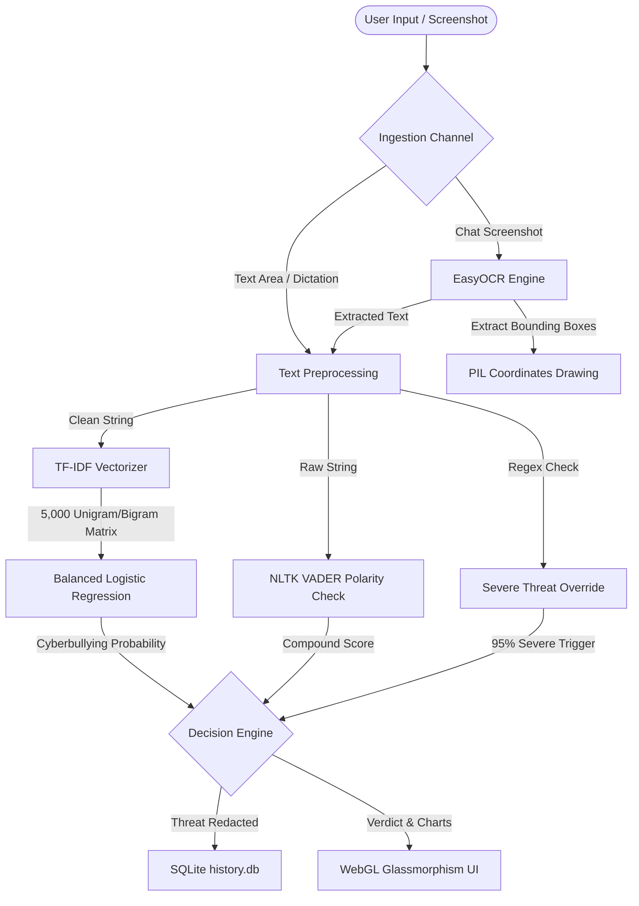

# ShieldX: Technical Documentation & Presentation Guide

Welcome to the official technical documentation for **ShieldX**, an AI-powered cyberbullying detection and content moderation console. This document serves as a comprehensive guide explaining the engineering architecture, machine learning models, computer vision pipeline, and security mechanisms of ShieldX.

---

## 👨‍💻 Project Identity & Authorship
* **Project Name**: ShieldX
* **Founder & Developer**: Yuvaraj Kumaran K
* **Academic Year**: III BSc AIML (Artificial Intelligence & Machine Learning)
* **Domain**: Natural Language Processing (NLP), Computer Vision (OCR), Software Security, and Web-based AI Systems.

---

## 🛠️ System Architecture

ShieldX is built as a self-contained, high-performance web dashboard utilizing a hybrid Python-Flask micro-backend and a responsive client.



### 1. Ingestion Channel
* **Manual Input**: Standard textarea inputs capped at 1000 characters.
* **Voice Dictation**: Directly maps browser-side speech recognition (`webkitSpeechRecognition`) to the input text area.
* **Screenshot OCR**: Image files uploaded through form bounds are parsed entirely in-memory using PIL (Pillow).

### 2. In-Memory OCR Pipeline
Unlike typical OCR structures relying on Tesseract (which requires heavy local system-level installs and DLL compilation), ShieldX uses **EasyOCR**:
* The image is scaled up by a factor of 2 (`img.resize((w * 2, h * 2))`) to enhance text block pixel density and improve OCR recognition rates on high-resolution smartphone screens.
* EasyOCR maps sentences, outputs their bounding boxes `(xmin, ymin, xmax, ymax)`, and draws colored outline overlays on a duplicated canvas before converting the image to Base64 to output directly to the client.

### 3. NLP Preprocessing
Raw strings are cleaned using regex transformations:
* Convert all characters to lowercase.
* Strip punctuation, emojis, and non-alphabetic elements (`re.sub(r"[^a-z\s]", " ", text)`).
* Normalize multiple spaces into single spaces.

---

## 📊 Machine Learning Model Details

ShieldX rejects multi-model complexity in favor of a single, highly optimized and balanced **Logistic Regression** classifier.

### 1. TF-IDF Feature Engineering
* **Vectorizer**: `TfidfVectorizer` mapping unigrams and bigrams.
* **Vocabulary Cap**: Restricted to `5,000` maximum features to prevent memory bloat and speed up real-time server response times.

### 2. Class Imbalance Resolution
The training dataset contains approximately ~47,000 records, showing a significant class imbalance:
* Bullying records: **~39,000**
* Safe/Not-Bullying records: **~7,900**

In a standard model, this 5:1 ratio would bias the classifier towards the majority class, causing severe false positives. ShieldX resolves this by training the model with **balanced class weights**:
\[w_j = \frac{n}{k \times n_j}\]
Where:
* \(n\) = Total number of samples in the training set
* \(k\) = Number of classes (2)
* \(n_j\) = Number of samples belonging to class \(j\)

This weights minority classes higher, leading to:
* **Accuracy**: 79.71%
* **F1-Score**: 81.85%

### 3. Sentiment Polarity Fallback
Using **NLTK VADER**, ShieldX calculates a compound polarity score between `-1.0` (extremely negative) and `+1.0` (highly positive). If a sentence is classified as safe by the ML model but contains strong negative vocabulary resulting in a compound score \(\le -0.4\), it is flagged as **Offensive Content** (warning), preventing borderline toxicity.

### 4. Severe Threat Guardrails
To guarantee absolute safety, ShieldX applies a hard-coded regex override:
* If the text contains severe threat indicators (e.g., `"kill yourself"`, `"suicide"`, `"murder"`), the backend automatically forces a **95% Cyberbullying probability** bypass, ensuring immediate blocking.

---

## 🔒 Security Hardening

To ensure the project is enterprise-ready and safe for deployment:
* **XSS Shielding**: User input text is escaped using `html.escape()` before being wrapped in highlighted `<mark>` tags to prevent Cross-Site Scripting injections.
* **DoS Prevention**: Restricted maximum payload uploads to `16MB` (`MAX_CONTENT_LENGTH`) to prevent memory overload.
* **Zero Disk Storage**: Screen OCR processing is done entirely in memory via byte streams (`io.BytesIO()`), leaving no trace on local drives.

---

## 🖥️ WebGL User Interface & Visuals
* **3D Particle Wave**: An interactive WebGL environment rendered using **Three.js** that responds to mouse coordinates, indicating active system surveillance.
* **3D Hero Orb**: A wireframe icosahedron and orbital ring in the Hero Column showing the ShieldX logo.
* **Chart.js Speedometers**: Displays real-time radial dials representing sentiment compound scores and radar charts highlighting toxicity metrics.

---

## 📂 SQLite Audit Database Schema

SQLite handles persistent audit logs. The schema is stored in `history.db`:

```sql
CREATE TABLE IF NOT EXISTS history (
    id INTEGER PRIMARY KEY AUTOINCREMENT,
    time TEXT,          -- Date and time of audit
    input_type TEXT,    -- 'Text Scan' or 'Image OCR Scan'
    source_name TEXT,   -- 'Manual Text Input' or image filename
    content TEXT,       -- Escaped content string
    result TEXT,        -- '🟢 SAFE', '🟠 OFFENSIVE', '🔴 CYBERBULLYING'
    confidence REAL     -- AI confidence percentage
);
```

---

## 🚀 Running & Deploying the Project (Render Unified Server)

ShieldX runs as a unified web application serving both the high-end 3D visual frontend (via standard Flask template routing) and the ML backend engines.

### 🌐 Deploying on Render
1. **GitHub Setup**: Initialize a git repository locally, commit all workspace files, and push them to a public or private GitHub repository.
2. **Render Dashboard**: 
   * Sign up at [render.com](https://render.com).
   * Click **New +** and choose **Web Service**.
   * Link your GitHub repository.
3. **Environment Configuration**:
   * **Language**: `Python`
   * **Branch**: `main`
   * **Python Version**: Configured automatically via `.python-version` as `3.10.13` (prevents dependency conflicts and source compilation loops for numpy and scikit-learn).
   * **Build Command**: 
     ```bash
     pip install -r requirements.txt
     ```
   * **Start Command**: 
     ```bash
     gunicorn app:app
     ```
4. **Deploy Site**: Click **Deploy Web Service**. Render will compile the dependencies (PyTorch, EasyOCR, Scikit-Learn) and deploy your consolidated portal at your free `.onrender.com` URL automatically.


